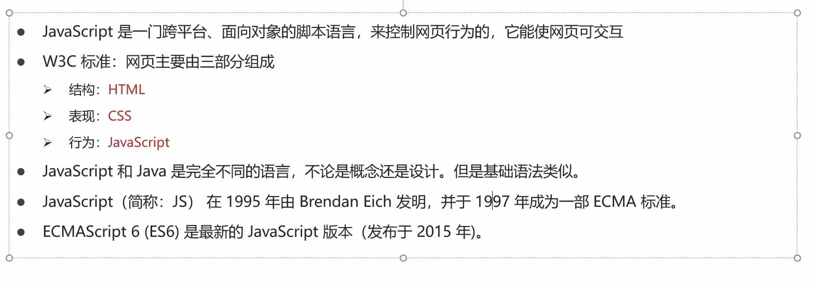

# DQL

## 查询语法

<figure><figcaption></figcaption></figure>

## 基础查询(SELECT)

<figure><figcaption></figcaption></figure>

## 条件查询(WHERE)

<figure><figcaption></figcaption></figure>

#### null值得比较不能用 =  != 需要用 is, is not

## 排序查询（ORDER BY）

<figure><figcaption></figcaption></figure>

## 聚合函数

<figure><figcaption></figcaption></figure>

## 分组查询（GROUP BY）

<figure><figcaption></figcaption></figure>

## 分页查询（LIMIT）

<figure><figcaption></figcaption></figure>
